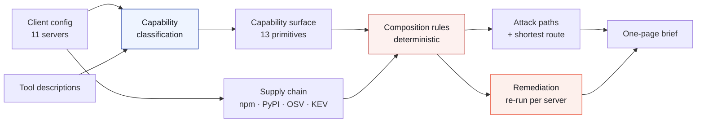

# Blast Radius

**Finds the attack paths your MCP servers create together — not one at a time.**

Built for the Cursor Cybersecurity Hackathon, London, 1 August 2026.

---

## The problem

A server that reads files is not a vulnerability. A server that makes HTTP
requests is not a vulnerability. Installed together, they are an exfiltration
primitive.

This matters because of how MCP actually works. The model does not experience
your installed servers as separate things with separate trust boundaries. It
receives one flat list of tools and will use a tool from server A and a tool
from server B in the same turn, without anything in the protocol suggesting it
should not. The unit of risk is therefore not the server. It is the **union of
everything installed**.

Every MCP security tool we could find audits one server at a time. None of them
can see this, structurally — not because they are badly built, but because the
finding does not exist at the level they operate on.

Meanwhile MCP is a supply chain that nobody treats as one. There is no lockfile.
There is usually no review step. In the common `npx -y` case there is not even a
pinned version: your agent resolves and executes whatever was published most
recently, on every launch, with your credentials in its environment.

## What it does

Point it at a client configuration — `claude_desktop_config.json`,
`.cursor/mcp.json`, any of them — and it answers one question: *what can an
attacker who controls a web page, an issue comment or an email make this agent
do?*



On the sample configuration — eleven servers a working developer would plausibly
install, each defensible on its own — it finds **10 complete attack paths, 4 of
which require more than one server acting together**.

## The architectural claim

> The language model does **classification** and **location**.
> A deterministic rules engine produces every security claim.

Ask any AI-security demo "how do you know the model didn't invent that finding?"
and the answer is usually a shrug. Here the model cannot invent a finding,
because it is never asked to produce one.

**What the model does.** It reads a tool description written in English by
whoever built the server, and assigns capabilities from a closed list of
fourteen. This is genuinely a language problem: there is no schema to consult,
and "Recursively search for files and directories matching a pattern" means
`fs.read` only if you can read. It also locates spans of description that
instruct the model rather than describe the tool, and returns them **verbatim**.

**What the model does not do.** Decide what is dangerous. Rank anything. Grade
severity. Choose which attack paths exist. All of that is a table lookup against
rules a human wrote in [`src/lib/engine/paths.ts`](src/lib/engine/paths.ts),
joined to published threat intelligence.

Three constraints keep it honest:

- **Capabilities are validated against the vocabulary** before they reach the
  engine. An invented capability is dropped, not silently carried forward.
- **Quoted spans are verified against the source.** The scan checks that the
  model's quote occurs character-for-character in the description it was
  attributed to, and discards it otherwise. The model can point at text; it
  cannot fabricate a quote.
- **Severity is a pure function** in one place, and nothing de-escalates. A
  rule's base severity is a floor.

If the classifier returned nonsense, you would get **fewer findings, never
invented ones**. That is the property worth having.

## The composition finding

This is the part that justifies the tool existing.

For every rule whose legs are all satisfiable, the engine asks: *can any single
server walk this entire path alone?*

- **Yes** → that is a per-server problem, and per-server tooling would catch it.
  We name the server and say so.
- **No** → the path exists only because these servers are installed *together*.
  Every server on it is individually defensible. Nothing that audits one server
  at a time can see it.

On the sample config that split is 6 solo and 4 composed. The composed ones are
the interesting half:

| Path | Route | Why it is invisible per-server |
|---|---|---|
| Injected credential theft | `aws` → `notion-sync` → `aws` | Neither server reads credentials *and* has egress |
| Local file exfiltration | `aws` → `filesystem` → `aws` | `filesystem` cannot reach the network |
| Database exfiltration | `aws` → `memory` → `aws` | `memory` has no egress of its own |
| Cloud infrastructure change | `aws` → `fetch` | `fetch` cannot touch IAM; `aws` has no untrusted ingress |

The engine reports the **shortest** route rather than every possible one. With
eleven servers most legs have six or seven providers, and listing them all is
technically complete and practically useless — it buries the shape of the attack
under a wall of chips. Breadth is reported separately as a count.

## So which server do you uninstall?

This is the question a scanner has to answer to be worth running, and for a
composed surface the honest answer is uncomfortable. `remediate.ts` re-runs the
whole engine once per server, with that server's tools removed, and counts what
actually closes.

On the sample configuration:

| | |
|---|---|
| Servers whose removal closes **zero** paths | **7 of 11** |
| Best single removal | closes **1 of 10** paths |
| Smallest subset (≤3) that closes everything | **none exists** |
| Paths closed by removing all ingress capability | **10 of 10** |

The seven that change nothing include `shell` and `puppeteer` — the two entries
anyone would point at first. They are not load-bearing, because six other
servers provide the same leg. **The scariest-sounding server on the list is
usually irrelevant to the finding**, which is precisely why per-server review
produces the wrong remediation as well as missing the risk.

So the remedy is not uninstalling, it is **separation**: run ingress-capable
servers in a session that holds nothing egress-capable. The tool says which
split closes how many paths, and where no split helps it says that instead of
manufacturing an action.

Nothing in that table is heuristic. It is the same set arithmetic as the scan,
evaluated over a reduced tool surface — a path closes if and only if some leg
has no provider left.

## Two artifacts, one pipeline

| | Dashboard | Security brief |
|---|---|---|
| Route | `/` | `/brief` |
| Reader | The person deciding what to change | The person justifying that decision |
| Register | Interactive surface map, per-path detail, remediation impact | One side of A4, prints to ink |
| Shared | Identical findings *and* identical remediation numbers — no divergent second source of truth | |

## Is this a real problem? We counted.

Rather than asserting that MCP is an unguarded supply chain, `scripts/corpus-scan.ts`
pulls **every server published to the official MCP registry** and joins it
against npm, PyPI, OSV and CISA KEV.

This is a **census, not a sample** — 19,513 servers across 63,317 published
versions. These figures are exact.

| | |
|---|---|
| Backing packages with a **single maintainer** | **93.8%** (6,414 of 6,837) |
| Servers publishing **no source repository** | 19.1% (3,726) |
| Servers that shipped a new version in the last 30 days | 6,889 |
| Median time since last publish | 51 days |
| Remote servers, where the operator sees every call argument | 8,750 |

That first number is the one to sit with. For 93.8% of these packages, exactly
one npm or PyPI account stands between an attacker and code execution on every
machine that installs them — with the user's credentials already in the
environment, and no pinned version to slow it down.

**Two results cut the other way, and are reported as found.** Only 40 servers
are backed by a package with a published advisory. And **zero** carry a CVE on
CISA's actively-exploited list — we checked all 1,656 and found none. MCP is not
yet being exploited through its dependencies. The exposure is structural, not
historical. Reporting a clean result as clean is the only thing that keeps the
dirty ones meaningful.

### Capability sample

The registry publishes a description per server but not its tool list, and
enumerating tools for real would mean launching nineteen thousand unknown
binaries — precisely what this tool exists to warn against. So capability
classification runs over a random, seeded sample of 240 server descriptions
using the same classifier the app uses.

**6.3% reach a complete attack path on their own.** That is a floor, twice over:
a one-paragraph description carries far less than a real tool list, and it
counts only servers dangerous *alone*. The number that matters is what happens
when you install eleven together — which is what the scan measures, and why the
sample config produces ten paths when no single server produces more than three.

The sample also found **zero injection spans** across 240 real registry
listings. The public registry is not currently poisoned. The planted payload in
the demo config is synthetic and labelled as such in the fixture.

## Tool poisoning

A tool description is loaded into the model's context every session, before the
user types anything. It is not data the model chooses to read — it is part of
the catalogue. Instructions placed there execute by default.

The scanner finds five shapes, and quotes each verbatim with its offset:

`instruction-to-model` · `conceal-from-user` · `out-of-scope-file-access` ·
`tool-sequencing` · `encoded-content`

On the sample config it finds two spans in one tool, and the finding composes
with everything else: `notion-sync`'s poisoned description asks the model to
read `~/.aws/credentials`, which is why the classifier assigns it
`secrets.read`, which is why it appears as the credential leg of the
**Injected credential theft** path. The poisoning is not a separate observation
sitting beside the graph. It *is* a leg of the graph.

## Data provenance

Everything is pulled at build time and committed, so the scanner makes **no
outbound request while it runs**. The demo is deterministic and works offline.

| Source | What it grounds | Size |
|---|---|---|
| [CISA KEV](https://www.cisa.gov/known-exploited-vulnerabilities-catalog) | Which CVEs are actually being exploited | 1,656 CVEs (332 ransomware-linked) |
| [MITRE ATT&CK](https://attack.mitre.org) | Technique labels on every path | 15 techniques, verbatim records |
| [OSV.dev](https://osv.dev) | Package advisories | 232 advisories over 9,281 packages |
| [MCP registry](https://registry.modelcontextprotocol.io) | Provenance and the corpus | 19,513 servers |

Every ATT&CK id cited by a rule is checked to exist in the committed table, and
every committed technique is checked to be cited by a rule — `verify-engine.ts`
enforces both directions, so a rule can never quote a technique we did not pull,
and the dataset can never accumulate records nothing uses.

## Running it

```bash
npm install
```

```bash
npm run dev
```

Verify the engine (52 checks against the real datasets):

```bash
npx tsx scripts/verify-engine.ts
```

Reproduce the corpus figures:

```bash
node --env-file=.env.local --import tsx scripts/corpus-scan.ts 240
```

Re-pull the datasets (only needed when the upstream sources publish updates):

```bash
node scripts/seed-registry.mjs && node scripts/build-registry-index.mjs
```

```bash
node scripts/seed-threat.mjs && node scripts/seed-supply.mjs
```

The verification script covers the traps that would break the product without
breaking the build: a rule citing an unseeded ATT&CK technique renders as a
missing label rather than an error; and the composition test inverting would
mark every single-server path as composed and escalate every severity by a band.

## Safety and scope

Blast Radius is a **demonstration prototype**. It is not a security product and
its output is not an audit.

It deliberately **does not launch the servers it analyses**. Discovering a tool
list for real means starting the process, and starting eleven unknown binaries
to find out whether they are safe has the obvious problem. The scanner works
from a static config plus tool definitions supplied by the caller; a real
deployment would pass definitions captured from a live client session.

The sample configuration is **synthetic**. The package names and launch commands
are real, because they are the servers people actually install and their
supply-chain facts are real. The tool definitions are representative rather than
captured. The two planted items — the poisoned `notion-sync` description and the
token-shaped environment values — are labelled in
[`src/lib/demo/fixture.ts`](src/lib/demo/fixture.ts). No live credential appears
anywhere in this repository.

Findings describe **capability, not intent**. That a server *can* reach a
credential file says nothing about whether its author meant it to. Every
finding is phrased as what the surface permits, and the supply-chain checks
report facts with their source attached so a reader can disagree with our
reading of them.
